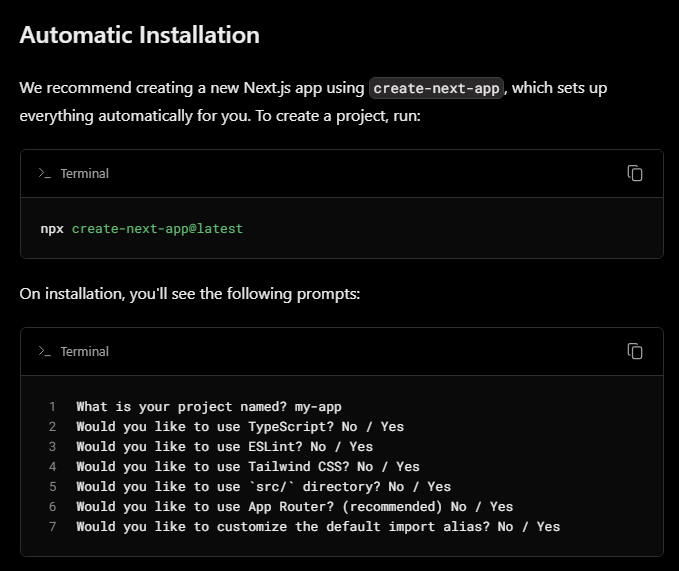

# nextjs_app

 ## Setup

### Prerequisites

1. Install version 16.x of [Node.js](https://nodejs.org/en/download/).

Optional (for first time: https://nextjs.org/docs/getting-started/installation)


### Getting Started

1. Clone the repository

    ```bash
    git clone https://github.com/Sark42/nextjs_app.git
    ```

2. Install dependencies

    ```bash
    npm install
    ```

